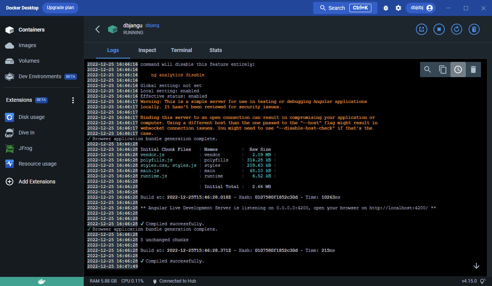

# Angular Minimal

This project was generated with [Angular CLI](https://github.com/angular/angular-cli) version 15.0.4.

## This runs using the Angular Development server

Run `ng serve` for a dev server. Navigate to `http://localhost:4200/`. The application will automatically reload if you change any of the source files.

### Can you use dev server in a production?

IF security is not an issue you can. For 80% of uses cases your Angular site is internal to your organization and having no more than few dosen users. Angular Dev Server is (more than) good enough for those scenarios. 

#### NGINX + CONTAINER

For actually going public please [follow these instructions[(https://referbruv.com/blog/dockerizing-an-angular-application-for-release-build-and-deploy/)

#### Good Alternative?

https://github.com/kestrel-org/kestrel

#### Azure

Azure App Svc + Using GitHub CI:
[How to deploy Angular app to Azure App Service running Linux from GitHub](https://devblogs.microsoft.com/premier-developer/how-to-deploy-angular-app-to-azure-app-service-running-linux-from-github/)

## Code scaffolding

Run `ng generate component component-name` to generate a new component. You can also use `ng generate directive|pipe|service|class|guard|interface|enum|module`.

## Build

Run `ng build` to build the project. The build artifacts will be stored in the `dist/` directory.

## Running unit tests

Run `ng test` to execute the unit tests via [Karma](https://karma-runner.github.io).

## Running end-to-end tests

Run `ng e2e` to execute the end-to-end tests via a platform of your choice. To use this command, you need to first add a package that implements end-to-end testing capabilities.

## Further help

To get more help on the Angular CLI use `ng help` or go check out the [Angular CLI Overview and Command Reference](https://angular.io/cli) page.
